# Brigade

**A printed menu is a promise the kitchen may not be able to keep.**

Brigade makes the menu a live function of the pantry, works out how long each dish has
left at tonight's actual sell rate, and warns the kitchen *before* it runs out.

🔗 **Live:** https://brigade-flame.vercel.app

---

## Submission

| | |
|---|---|
| **Team name** | *Brigade* — solo entry |
| **Problem statement** | VibeAthon 6.0 — Smart Restaurant Management System |
| **Levels attempted** | Platinum (User Stories 1–5) + Bonus |
| **Hosted application** | https://brigade-flame.vercel.app |

### Tech stack

| Layer | Choice |
|---|---|
| Frontend + API | **Next.js 15** (App Router) + TypeScript |
| Database | **Supabase Postgres** |
| Auth | Supabase Auth — email + password with OTP, Google OAuth |
| Authorization | **Postgres Row Level Security** (not UI conditionals) |
| Realtime | Supabase Realtime + polling fallback |
| Styling | Tailwind v4 + CSS custom properties |
| Charts | Hand-rolled SVG (no chart library) |
| Deployment | Vercel + Supabase Cloud |
| Testing | Vitest — 70 unit tests on the intelligence layer, plus 27 database assertions and 120 end-to-end assertions over real HTTP |

> **On the suggested stack.** The problem statement suggests *Node.js with Express*.
> Brigade uses **Next.js route handlers**, which run on Node — so the app deploys as a
> single unit with one build and one set of env vars. There is no separate Express
> service. The stack list is headed "Suggested"; this is stated plainly rather than
> hoped past.

### AI usage

**There is no LLM in the product.** The intelligence layer is deterministic statistics:

- EWMA demand forecasting, segmented by weekday × daypart
- Reorder points from consumption rate × supplier lead time, capped by shelf life
- Kasavana–Smith menu engineering (medians, not means)
- Item-item cosine similarity for recommendations
- Waste variance from an append-only stock ledger

Five of the six Platinum examples in the problem statement are statistical problems,
and the PS lists AI as **optional**. Computation was chosen over generation because the
numbers are auditable, the results reproduce exactly, and a live demo cannot fail on an
API rate limit.

AI *was* used to build it: **Claude Code** wrote and reviewed code throughout, which is
the premise of a vibe-coding hackathon. It also ran an adversarial audit of the live
deployment across five independent lenses (security, correctness, accessibility, auth,
rubric honesty), which found 44 confirmed defects — including three of my own false
claims. Those are listed in [`docs/07-submission.md`](docs/07-submission.md) rather than
quietly fixed.

The `insights` table stores `title`/`body` per row, so a natural-language narration
layer could be added without touching any of the maths. That seam is deliberate.

---

## Why this isn't a Toast clone

The problem statement forbids cloning an existing restaurant app, so the first job was
finding out what already exists.

**Toast and Square already ship recipe-level ingredient depletion with automatic 86.**
When a tracked ingredient hits zero, the POS marks dependent items unavailable on the
terminal and the kitchen screen. So "link recipes to stock and grey out what runs out"
is **table stakes, not innovation** — building only that *is* the forbidden clone.

Two gaps remain in what's actually shipped:

1. **Availability is staff-facing.** Toast computes the number and shows a `0` on the
   POS button. The guest at the table still has to ask, and the server still walks to
   the kitchen. The number never reaches the person choosing what to order.
2. **Everything is reactive.** Existing systems report an item is out *after* stock
   hits zero. Nothing tells the kitchen at 18:00 "you'll 86 the tandoori prawns at 19:25, you
   have 4 portions left" — and nothing uses that prediction to steer demand while there
   is still time to act.

### The mechanism: runway

Every dish carries a **runway** — minutes until it 86s at tonight's real sell rate.

```
portions(dish)  = min over ingredients of floor(stock / qty_per_portion)
velocity        = EWMA of units/hour for this weekday × daypart
runway(dish)    = portions / velocity × 60
```

One number, four surfaces:

| Surface | What runway does there |
|---|---|
| **Guest menu** | "4 left · 86s ~19:25". Near-86 dishes sink in the rail and get badged |
| **Kitchen** | The 86 board is a **countdown**, not an obituary — and names the binding ingredient |
| **Manager** | Reorder quantities and prep lists fall out of the same velocity model |
| **Revenue** | Demand steering favours high-margin dishes with long runway |

**Toast computes availability. Brigade computes time remaining, and acts on it.**

---

## User stories

| Level | Story | Where it lives |
|---|---|---|
| **Bronze** | US1 · modern, intuitive UI | Two deliberate densities on one token system — guest phone vs KDS wall screen |
| **Silver** | US2 · auth | `/auth/*` — email+password+OTP, Google OAuth, 7 roles in RLS |
| **Silver** | US3 · digital workflows | `/menu` `/cart` `/order/[id]` `/bill/[id]` `/reserve` |
| **Gold** | US4 · management dashboard | `/ops/kds` `/ops/floor` `/ops/inventory` `/ops/menu` `/ops/analytics` |
| **Platinum** | US5 · intelligent operations | `/ops/runway` + the forecasting, reorder and steering engine |
| **Bonus** | — | Predictive 86, demand steering, waste variance, multi-tenant from migration 001 |

Per-feature detail, including what is **read-only** and what is **cut**, is in
[`docs/features/`](docs/features/). Honest status is the point: a docs tree that claims
more than the deployed app is worse than no docs.

---

## The engineering worth looking at

**`place_order()` — the last-portion race.** Two guests both see "1 left" and tap at
the same instant. A read-then-write in application code lets both succeed and drives
stock negative. The function locks the affected ingredient rows `FOR UPDATE ORDER BY
id` — the ordering matters, or two concurrent orders with overlapping ingredients
deadlock — re-checks availability *inside* the transaction, and raises a typed
`INSUFFICIENT_STOCK` that the cart turns into a recovery rather than an apology.
Demand is aggregated **per ingredient across the whole order**, because two different
dishes sharing the last three lemons would each pass an independent check and
collectively oversell.

Verified on live data: forced to exactly 1 portion, two concurrent calls → one 200, one
`INSUFFICIENT_STOCK`, stock landed at 0 and never negative.

**Availability is a view, never a column.** There is no `is_available` anywhere. A
stored flag must be kept in sync by every code path that touches stock, and one missed
path means the menu lies to a guest. A view cannot drift.

**Stock is an append-only ledger.** `ingredients.stock_qty` is a projection of
`stock_movements`. That's what makes waste variance computable and gives an audit trail
for free. `npm run verify:data` reconciles the two and fails if they disagree.

**Authorization is in the database.** 43 RLS policies. The claim is testable: sign in as
a guest and hit the REST API directly — `ingredients` returns `[]`, another guest's
orders return `[]`, and cost never appears in any guest payload.

---

## Running it

```bash
npm install
cp .env.example .env.local        # fill from the Supabase dashboard
npm run sql:bundle                # → supabase/apply_all.sql, paste in the SQL editor
npm run seed                      # 6 weeks of plausible history
npm run dev
```

```bash
npm run check         # everything, explained in plain English (~3 min)
npm test              # 70 unit tests, no database needed
npm run sql:check     # throwaway Postgres, 27 assertions
npm run verify:data   # 14 checks against the live database
npm run verify:features  # 21 blocks, 120 assertions, over real HTTP
```

Full setup, deploy and troubleshooting: [`docs/08-runbook.md`](docs/08-runbook.md) and
[`DEPLOY.md`](DEPLOY.md).

### Demo logins

Password for all: `brigade-demo-2026`

| Email | Role | Lands on |
|---|---|---|
| `owner@brigade.test` | chef de cuisine | `/ops/analytics` |
| `manager@brigade.test` | sous chef | `/ops/inventory` |
| `grill@brigade.test` | chef de partie | `/ops/kds`, filtered to grill server-side |
| `expo@brigade.test` | the pass | `/ops/kds` |
| `server@brigade.test` | chef de rang | `/ops/floor` |
| `host@brigade.test` | maître d' | `/ops/reservations` |
| `priya@brigade.test` | guest | `/menu` |

---

## Every user flow

One chart per flow, with the account to sign in as, the problem it addresses from the
brief, and the mechanism that answers it. **Read the branches, not the straight line** —
a flow that only ever succeeds is a demo. The diamonds are where the product is: the last
portion sold to exactly one of two people, the cook who cannot serve a plate, the bill
that refuses while food is still cooking.

All ten accounts share one password: `brigade-demo-2026`.

| Who | Flow |
|---|---|
| Priya, diner | [Flow P1: discover, order, track, pay](#flow-p1-discover-order-track-pay) |
| Priya, diner | [Flow P2: book a table, or join the queue](#flow-p2-book-a-table-or-join-the-queue) |
| Priya, diner | [Flow P3: find it again tomorrow](#flow-p3-find-it-again-tomorrow) |
| Anyone | [Flow A1: get an account](#flow-a1-get-an-account) |
| Rahul, grill | [Flow R1: work the station](#flow-r1-work-the-station) |
| Joss, the pass | [Flow E1: send plates away](#flow-e1-send-plates-away) |
| Kit, server | [Flow S1: the floor, and the bill](#flow-s1-the-floor-and-the-bill) |
| Sofia, maître d' | [Flow H1: the book and the queue](#flow-h1-the-book-and-the-queue) |
| Tom, manager | [Flow M1: the pantry](#flow-m1-the-pantry) |
| Tom, manager | [Flow M2: the menu and the recipes](#flow-m2-the-menu-and-the-recipes) |
| Meera, owner | [Flow O1: the numbers](#flow-o1-the-numbers) |
| Everyone | [The runway board](#the-runway-board) |

[`docs/09-flows.md`](docs/09-flows.md) is the source for this section and carries more:
the step-by-step happy path, the full table of refusals, and which automated check covers
each step.

### Flow P1: discover, order, track, pay

**Sign in as** `priya@brigade.test` — you will also need `grill@brigade.test` and
`expo@brigade.test` in a second window to cook and serve it. Password for all ten accounts:
`brigade-demo-2026`.

**The problem** — PS challenge 1, *"customers waiting to know whether dishes are
available."* A printed menu is a promise the kitchen may not be able to keep. The diner asks
the server, the server walks to the kitchen, the kitchen counts, and the answer is already
out of date by the time it comes back. Meanwhile two tables can be sold the same last
portion.

**How Brigade solves it** — the menu is not a document, it is a query. Portions come from
the recipe against live stock, so the number on Priya's phone *is* the pantry. Placing the
order takes row locks and re-checks inside the transaction, so the last portion has exactly
one buyer — and the loser is told what is still available rather than shown an error.

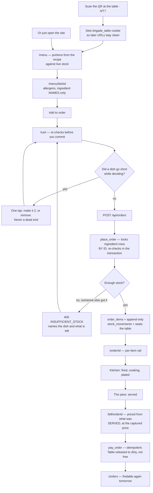

### Flow P2: book a table, or join the queue

**Sign in as** `priya@brigade.test`. To watch the booking arrive, `host@brigade.test`.

**The problem** — PS challenge 3, *"long waiting times for tables and orders."* A walk-in
asks how long the wait is and gets a number the host invented. It is usually wrong, and
wrong in either direction costs the restaurant: too high and the party leaves, too low and
they are furious at minute forty.

**How Brigade solves it** — the quote is the **median of real seated-to-paid durations** for
tables that actually fit the party. Below ten comparable samples it states a default rather
than dressing a guess as data. Capacity is decided inside `book_table()`, because the rule
needs to count tables and a diner is not allowed to see tables.

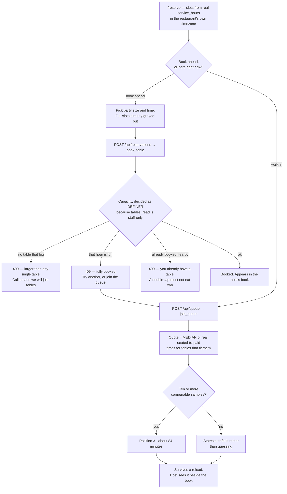

### Flow P3: find it again tomorrow

**Sign in as** `priya@brigade.test`.

**The problem** — a diner pays, closes the tab, and next day wants the bill. Until this flow
existed they could not have it: `/order/[id]` was reached once by a redirect, the cart was
cleared on the same line, and the id lived nowhere but the address bar. Their own order was
visible to the kitchen and not to them.

**How Brigade solves it** — one page, where the row decides where it sends you.
`orders_read_own` is `guest_id = auth.uid()`, so the database does the scoping and there is
no ownership check in the page at all.

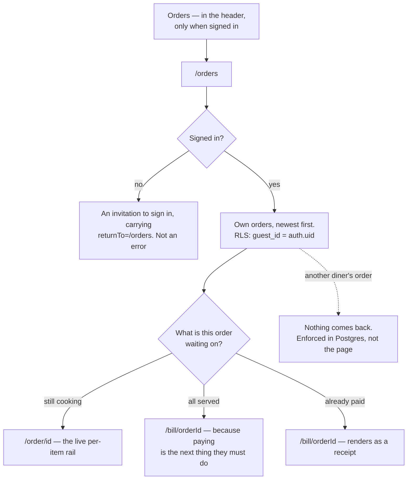

### Flow A1: get an account

**Sign in as** any of the ten seeded accounts, or sign up with an address you own to walk the
real verification path. Seeded password: `brigade-demo-2026`.

**The problem** — PS user story 2. An order is a commitment, so it needs a name attached —
but authentication is also the first thing a new person touches, and the point at which they
are least willing to feel stuck.

**How Brigade solves it** — email and password with a 6-digit code, or Google in one tap.
Roles are **never self-selected**: a signup that could choose its own role is privilege
escalation, so staff are seeded and a new account is always a guest. After signing in,
everyone lands on the surface for their job rather than a generic dashboard.

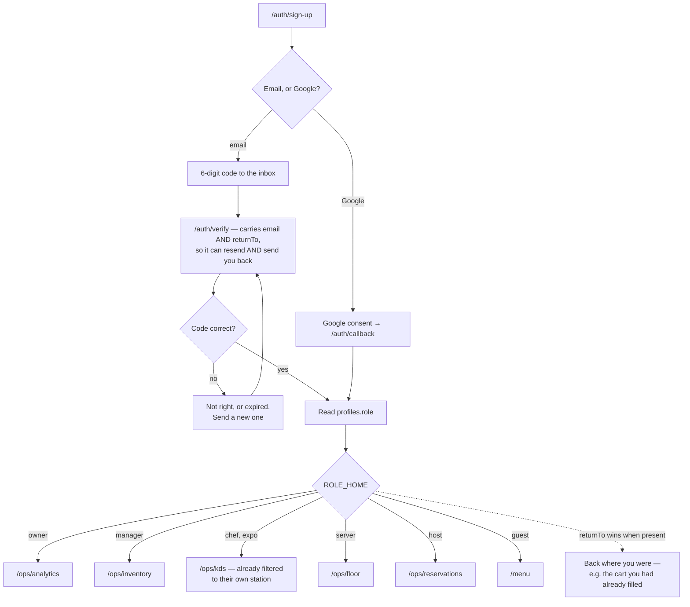

### Flow R1: work the station

**Sign in as** `grill@brigade.test` — Rahul Desai, chef de partie on grill. Then try
`saute@brigade.test` on the same ticket to watch the station gate refuse.

**The problem** — PS challenges 4 and 6, *"delayed communication between customers, staff and
kitchen"* and *"inefficient staff coordination."* Paper chits get lost, get wet, and carry no
state. Nobody can see how long a ticket has waited, and the wrong person can pick it up.

**How Brigade solves it** — dockets on a wall screen, filtered to the cook's own station from
their profile, with ticket age escalating in **three ways at once** — colour, glyph and words
— because kitchens have colourblind cooks and greasy screens. Every transition is validated
in the database, so the rule holds whatever the UI happens to render.

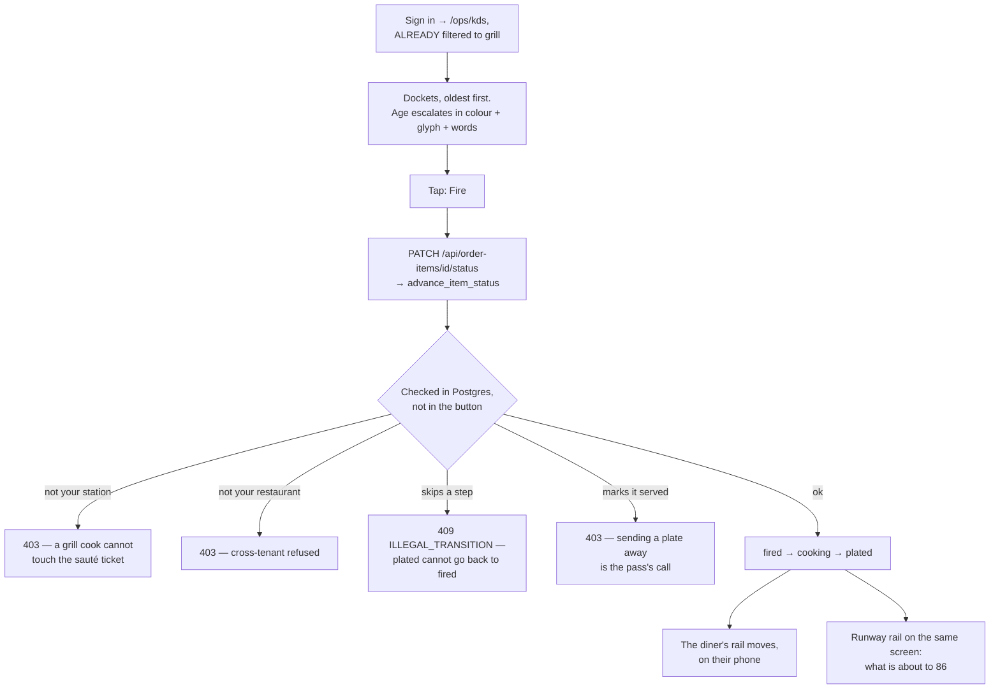

### Flow E1: send plates away

**Sign in as** `expo@brigade.test` — Joss Bell, on the pass.

**The problem** — a table should be served together, and the person who cooked one dish is
the worst judge of whether the whole table is ready. Someone has to own the moment food
leaves the kitchen.

**How Brigade solves it** — expo sees **every** station where a cook sees only their own, and
`plated → served` is restricted to expo, server, manager and owner inside
`advance_item_status()`. A cook's fat-finger cannot mark food served that never left.

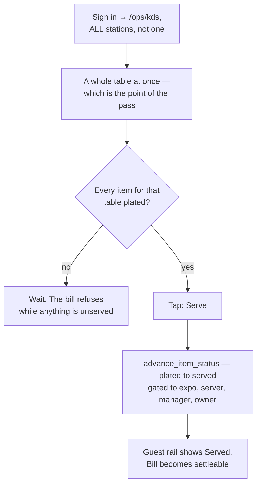

### Flow S1: the floor, and the bill

**Sign in as** `server@brigade.test` — Kit Nwosu, chef de rang.

**The problem** — PS challenge 5, *"manual order, billing and inventory management."* A table
that has paid but not been cleared is not free, and seating a party at it is worse than
leaving it empty. Handwritten bills also charge for food that never arrived.

**How Brigade solves it** — table state is driven by real events rather than typed in:
attaching an order seats the table, settling releases it to **dirty**, never straight back to
free. The bill is priced server-side from what was actually **served**, at the price captured
on each line when it was ordered — so a menu price change tonight cannot alter a bill from an
hour ago.

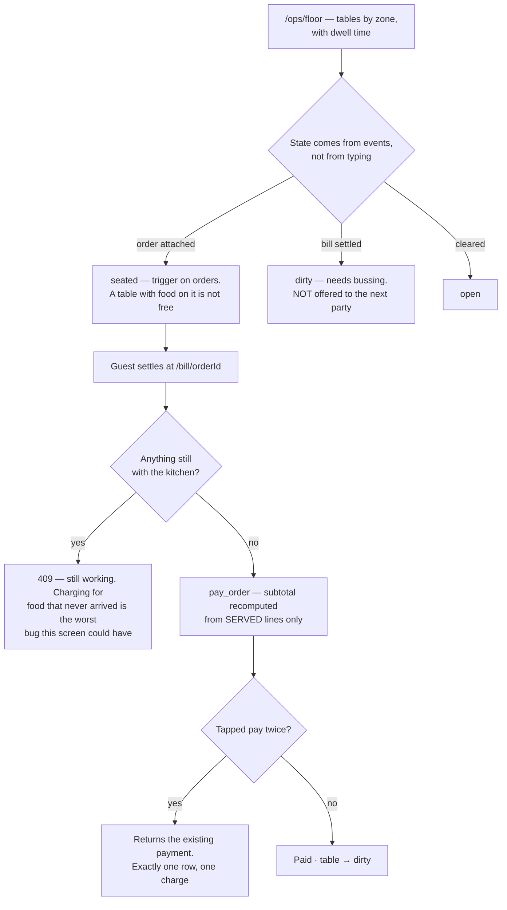

### Flow H1: the book and the queue

**Sign in as** `host@brigade.test` — Sofia Marín, maître d'.

**The problem** — PS challenge 3 from the other side of the podium. Seating decisions mean
trading the book against the queue, and if those live in two places the host does the join in
their head while people watch.

**How Brigade solves it** — both halves on one screen: upcoming bookings with party sizes,
and the live walk-in queue with each party's data-derived quote beside it.

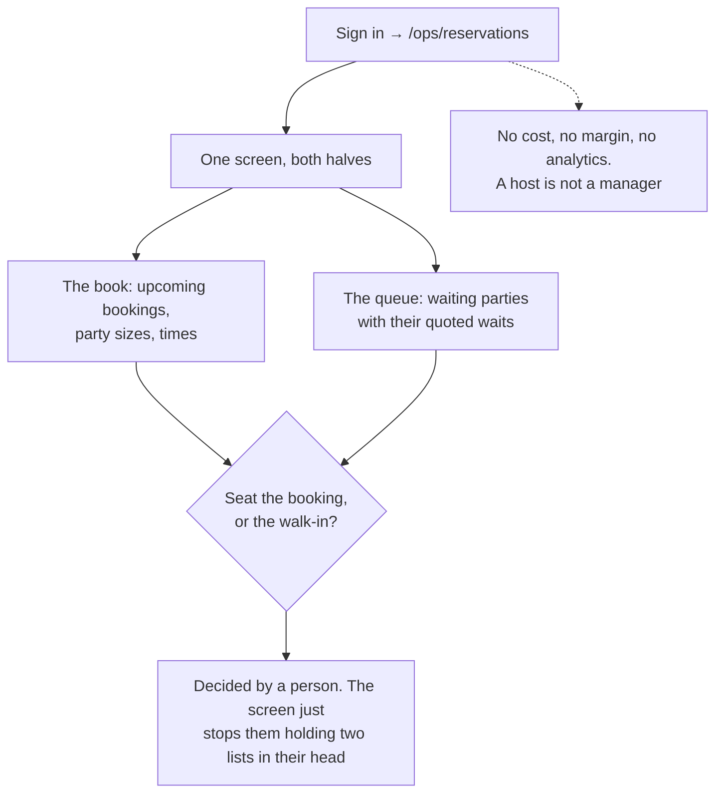

### Flow M1: the pantry

**Sign in as** `manager@brigade.test` — Tom Ellery, sous chef.

**The problem** — PS challenge 5, and the inventory half of the whole brief. Stock counted on
paper is wrong by the time it is typed up, reorder quantities are guessed, and nobody can say
where stock left without being sold.

**How Brigade solves it** — an **append-only ledger**. `stock_qty` is a projection of
`stock_movements`, and stock is only ever moved by `place_order()` or `adjust_stock()`. There
is no path — including talking straight to the database — that moves it without writing a
row. Reorder points come from real consumption × supplier lead time × 1.2, summed window by
window over actual service hours.

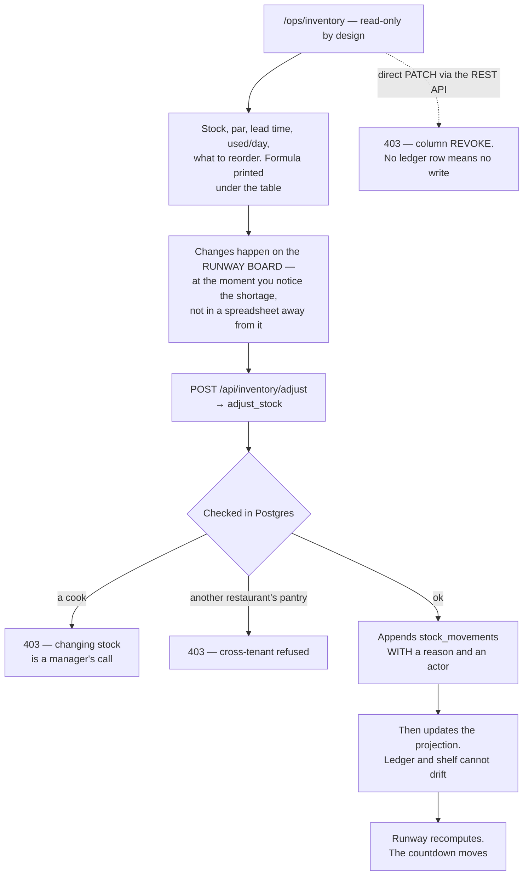

### Flow M2: the menu and the recipes

**Sign in as** `manager@brigade.test`, or `owner@brigade.test` for the same screen with
ownership settings.

**The problem** — PS challenge 2, *"limited visibility into menu items and restaurant
services."* A menu is usually a design file, disconnected from what a dish costs to make or
whether it can be made at all.

**How Brigade solves it** — every dish carries its bill of materials, so cost and margin are
computed rather than typed, and availability falls out of the same data. Quantities are
staff-only and scoped to the caller's own restaurant, because a recipe is the one thing a
restaurant most wants kept from a competitor.

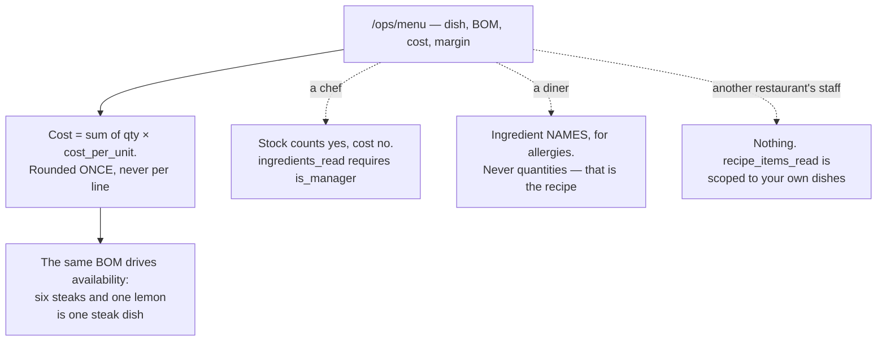

### Flow O1: the numbers

**Sign in as** `owner@brigade.test` — Meera Kapoor, chef de cuisine. Then open the same page
as `grill@brigade.test` to see the cost gate.

**The problem** — PS challenge 7, *"lack of operational insights and business analytics."*
Most restaurants know last night's revenue and nothing else. Which dishes to protect,
reprice, promote or cut gets decided on instinct.

**How Brigade solves it** — the **Kasavana–Smith matrix** over six weeks of real trading:
popularity against contribution margin, split on the **median** of each axis rather than the
mean, which a single outlier drags. Below 30 paid orders it draws no matrix at all and says
why.

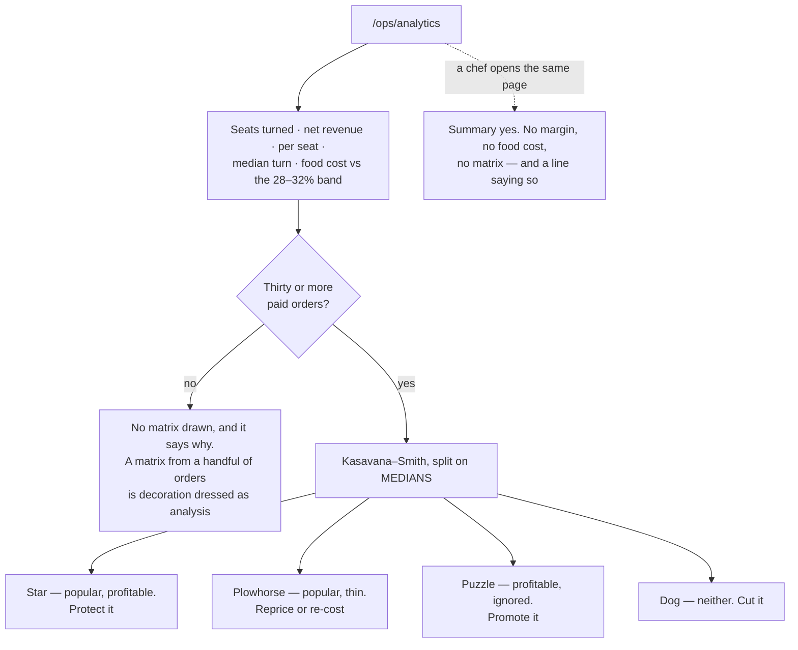

### The runway board

**Sign in as** any staff account. Use `manager@brigade.test` or `owner@brigade.test` if you
want the top-up buttons.

**The problem** — PS challenges 1 and 2 together, and the reason this project exists. Toast
and Square already deplete stock from recipes and auto-86 a dish, so *that* is table stakes.
What no till does is tell you **when** you will run out. The kitchen finds out at zero, which
is the one moment when nothing can be done about it.

**How Brigade solves it** — runway: portions ÷ tonight's actual sell rate, in minutes. Every
row names the ingredient that binds it, because "prawns 86 at 20:40" is information and
"because you have 0.55kg of prawns" is something a chef can act on in five minutes. And it
refuses to guess — four distinct honest answers rather than one fabricated time.

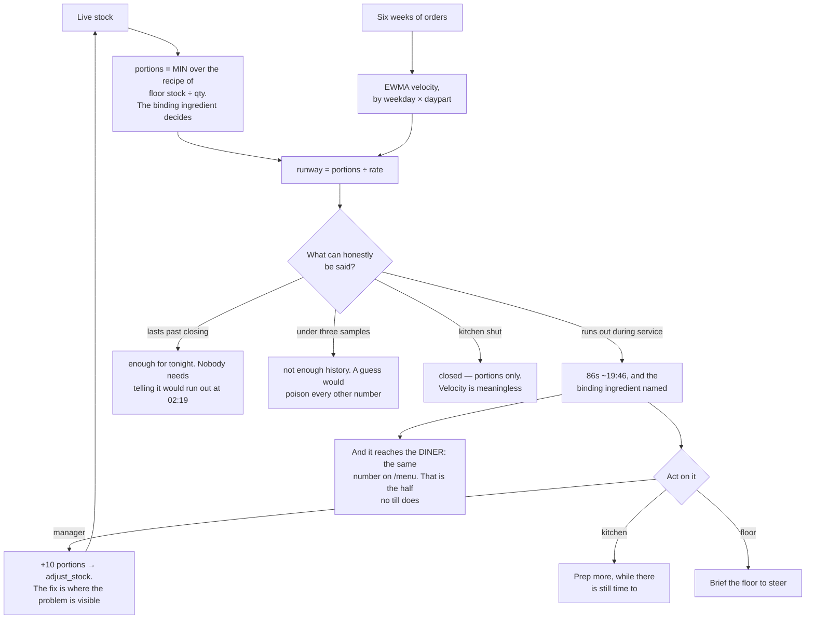
---

## Documentation

| Doc | What's in it |
|---|---|
| [`SOLUTION.md`](SOLUTION.md) | Every PS challenge → the mechanism that addresses it |
| [`docs/01-overview.md`](docs/01-overview.md) | Research, thesis, personas |
| [`docs/02-architecture.md`](docs/02-architecture.md) | Stack and 7 decision records |
| [`docs/03-data-model.md`](docs/03-data-model.md) | Schema, RLS, `place_order()` |
| [`docs/04-design-system.md`](docs/04-design-system.md) | Tokens with measured contrast ratios |
| [`docs/05-runway-engine.md`](docs/05-runway-engine.md) | All the maths |
| [`docs/07-submission.md`](docs/07-submission.md) | Compliance matrix + known defects |
| [`docs/09-flows.md`](docs/09-flows.md) | Every flow, per person, and the test that covers each step |
| [`wireframes/index.html`](wireframes/index.html) | 15 greybox screens, built before the UI |

---

## What this doesn't do

Stated up front rather than discovered under questioning:

- **Demand steering is a heuristic, not a validated uplift model.** Not A/B tested.
  Claiming a revenue figure would be fabrication; claiming a mechanism is fair.
- **Payment is simulated.** A sandbox PSP proves nothing a mock doesn't.
- **Sub-recipes (nested BOMs) are out of scope.** Toast supports them; three days
  didn't.
- **Six weeks of seeded history** demonstrates the algorithms, not real customer
  behaviour.
- **Recipe editing, staff management and split billing are cut**, with the reasoning in
  each feature doc.

---

*Sources for the research claims: [Toast platform docs](https://doc.toasttab.com/doc/platformguide/adminMenuItemInventoryOverview.html) ·
[Sculpture Hospitality 2025](https://www.sculpturehospitality.com/blog/restaurant-industry-statistics-2025) ·
[Apicbase](https://get.apicbase.com/restaurant-inventory-statistics/)*
