# 09 — Flows: every user, every path, and how to prove it works

Who does what, in what order, and the exact way to check each step really behaves. One
section per person, and every flow is laid out the same way so they stay comparable:

| | |
|---|---|
| **Sign in as** | the exact account to use, so you can walk the flow yourself |
| **The problem** | the real restaurant problem, tied to the numbered challenge in the brief |
| **How Brigade solves it** | the mechanism, named — not a feature list |
| **A flow chart** | every branch, including the refusals |
| **Happy path** | the steps in order |
| **Refusals** | what must *fail*, which is where most of the real behaviour lives |
| **How it is tested** | the automated check that covers it, and the by-hand version |

All ten accounts share one password: `brigade-demo-2026`.

Read the charts for the branches rather than the straight line. A flow that only ever
succeeds is a demo; the diamonds are where the product actually is — the last portion sold
to exactly one of two people, the cook who cannot serve a plate, the bill that refuses while
food is still cooking.

Nothing here is aspirational. Where a flow is partly built, it says so in the flow.

## Contents

| Who | Flow | Level |
|---|---|---|
| [Priya, diner](#priya-the-diner) | Discover → order → track → pay | US1–US3 |
| [Priya, diner](#flow-p3-find-it-again-tomorrow) | Find a past order and its bill | US3–US4 |
| [Priya, diner](#flow-p2-book-a-table-or-join-the-queue) | Book a table / join the queue | US3 |
| [Anyone](#flow-a1-get-an-account) | Sign up, verify, sign in, sign out | US2 |
| [Rahul, grill](#rahul-the-grill-station) | Work the station | US4 |
| [Joss, the pass](#joss-the-pass) | Send plates away | US4 |
| [Kit, server](#kit-the-floor) | The floor, and the bill | US3–US4 |
| [Sofia, maître d'](#sofia-the-book) | The book and the queue | US3 |
| [Tom, sous chef](#tom-the-pantry) | The pantry, the menu, the 86 | US4 |
| [Meera, chef de cuisine](#meera-the-numbers) | The numbers | US4–US5 |
| [Everyone](#the-runway-board) | The runway board | US5 |

## The logins

All ten accounts share one password: `brigade-demo-2026` (defined once, in
`supabase/seed/data.ts` as `DEMO_PASSWORD`, and read from there by the test script so the
two cannot drift).

| Email | Person | Role | Brigade title | Lands on |
|---|---|---|---|---|
| `owner@brigade.test` | Meera Kapoor | owner | Chef de cuisine | `/ops/analytics` |
| `manager@brigade.test` | Tom Ellery | manager | Sous chef | `/ops/inventory` |
| `grill@brigade.test` | Rahul Desai | chef · grill | Chef de partie | `/ops/kds` |
| `saute@brigade.test` | Ana Ferreira | chef · sauté | Chef de partie | `/ops/kds` |
| `expo@brigade.test` | Joss Bell | expo · pass | Expo | `/ops/kds` |
| `server@brigade.test` | Kit Nwosu | server | Chef de rang | `/ops/floor` |
| `host@brigade.test` | Sofia Marín | host | Maître d' | `/ops/reservations` |
| `priya@brigade.test` | Priya Shah | guest | — | `/menu` |
| `dan@brigade.test` | Dan Whitlock | guest | — | `/menu` |
| `mei@brigade.test` | Mei Tanaka | guest | — | `/menu` |

Where each role lands is not decoration — it is `ROLE_HOME` in `lib/auth/roles.ts`. A
chef de partie wants their station's tickets, a maître d' wants the book. Dropping
everyone on one dashboard is a tax paid once per shift, per person.

---

## How to read the "how it is tested" boxes

Three layers cover these flows, and they cover different things. A flow is only really
proven when the layer that *can* see it says so.

| Layer | Command | Sees | Cannot see |
|---|---|---|---|
| Unit | `npm test` | The runway maths in isolation, 69 cases | Anything involving a database or a screen |
| Schema | `npm run sql:check` | Whether the database *enforces* its rules — 27 assertions against a throwaway Postgres | Whether the app calls it correctly |
| Feature | `npm run verify:features` | 17 blocks driving the real HTTP API as the real people, against the deployed site | Anything visual — layout, colour, legibility |
| You | this document | Everything above plus how it looks and feels | — |

`npm run check` runs all of them in order, fastest-failing first, and explains each in
plain English.

**The by-hand steps still matter.** Two defects in this build were invisible to every
automated layer for days: the host's book loaded with HTTP 200 while being completely
empty, and `/cart` was reachable only by typing its URL because nothing linked to it. A
script that requests a path is not a person who has to find it.

---

## Priya, the diner

Phone, one-handed, dim and loud room, about 30cm from her face, roughly ninety seconds of
attention. She does not know what "expo" or "the pass" mean, so guest surfaces use plain
language throughout.

### Flow P1: discover, order, track, pay

**Sign in as** `priya@brigade.test` — you will also need `grill@brigade.test` and
`expo@brigade.test` in a second window to cook and serve it. Password for all ten accounts:
`brigade-demo-2026`.

**The problem** — PS challenge 1, *"customers waiting to know whether dishes are
available."* A printed menu is a promise the kitchen may not be able to keep. The diner asks
the server, the server walks to the kitchen, the kitchen counts, and the answer is already
out of date by the time it comes back. Meanwhile two tables can be sold the same last
portion.

**How Brigade solves it** — the menu is not a document, it is a query. Portions come from
the recipe against live stock, so the number on Priya's phone *is* the pantry. Placing the
order takes row locks and re-checks inside the transaction, so the last portion has exactly
one buyer — and the loser is told what is still available rather than shown an error.

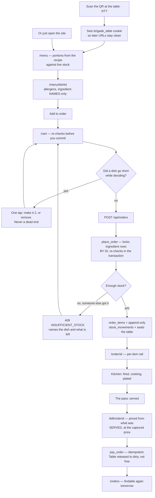

**Happy path**

1. **Arrive.** Either `https://brigade-flame.vercel.app/` or, at a table, scan the QR →
   `/t/T7`. The QR route sets a `brigade_table` cookie and redirects to `/menu`, so every
   later URL stays clean and the order knows which table it came from.
2. **Read the menu** (`/menu`). Each dish shows what it costs and, when it is running
   short, how many portions are left and roughly when it will run out. A dish with plenty
   shows no badge at all — a countdown on everything is noise that devalues the ones that
   matter.
3. **Open a dish** (`/menu/<id>`) for the description, allergens and what is in it.
   Ingredient *names* only: quantities are the recipe, and the recipe is the restaurant's.
4. **Add to order.** The header's Order button gains a count. On a phone the nav collapses
   behind a button but the cart never does — it is the action she is in the middle of.
5. **Review** (`/cart`). If a dish went short while she was deciding, the line is flagged
   *before* she submits, with a one-tap fix ("make it 2" / "remove").
6. **Place it.** `POST /api/orders` → `place_order()`. This is the atomic bit: it locks
   the ingredient rows in id order, re-checks availability inside the transaction, writes
   the items, appends the depletion to the ledger, and updates stock — or refuses the
   whole thing.
7. **Watch it cook** (`/order/<id>`). A per-item rail advances as the kitchen works:
   placed → fired → cooking → plated → served. Items at one table finish at different
   times, so status is per item, not per order.
8. **Pay** (`/bill/<orderId>`). Priced from what was actually *served*, at the price
   captured on each line when it was ordered. Tip optional.

**Refusals — the interesting half**

| She tries | What happens | Why |
|---|---|---|
| Order more than exists | 409, "Only 3 Tandoori prawns left." | Named the dish and the real number, so there is something to do next |
| Order the last portion at the same instant as another diner | Exactly one succeeds; the other is told it just went | Two guests must not both be sold the last one |
| Order without an account | 401, "Sign in to place an order." | An order is a commitment; it needs a name on it |
| Order before verifying her email | 403 | Enforced in `place_order()`, not just in the UI |
| Pay while food is still cooking | 409, "The kitchen is still working on part of this order." | |
| Tap pay twice | One charge. Exactly one payment row | |
| Open someone else's order or bill | Nothing comes back | RLS, not a UI condition |

> **How it is tested**
>
> - **Automated:** `verify:features` blocks *The live menu*, *Ordering, and the last
>   portion*, *Following your order*, *The bill*. The race is real: two sessions fire
>   concurrent requests for everything that remains and exactly one must win.
> - **The menu number is checked against the pantry**, not just displayed: the test
>   recomputes `floor(stock ÷ qty)` for the binding ingredient and compares.
> - **By hand:** sign in as `priya@brigade.test`, order a grill dish and a sauté dish,
>   keep `/order/<id>` open on a phone while you advance the tickets on the KDS in another
>   window. To see the race, open `/menu` in two browsers on a dish with 1 portion left and
>   tap Place order in both as close together as you can.
> - **Prove the ledger:** after ordering, `npm run verify:data` — "ledger equals
>   projection" must pass. If stock moved without a ledger row, every number in the
>   product is suspect.

### Flow P2: book a table, or join the queue

**Sign in as** `priya@brigade.test`. To watch the booking arrive, `host@brigade.test`.

**The problem** — PS challenge 3, *"long waiting times for tables and orders."* A walk-in
asks how long the wait is and gets a number the host invented. It is usually wrong, and
wrong in either direction costs the restaurant: too high and the party leaves, too low and
they are furious at minute forty.

**How Brigade solves it** — the quote is the **median of real seated-to-paid durations** for
tables that actually fit the party. Below ten comparable samples it states a default rather
than dressing a guess as data. Capacity is decided inside `book_table()`, because the rule
needs to count tables and a diner is not allowed to see tables.

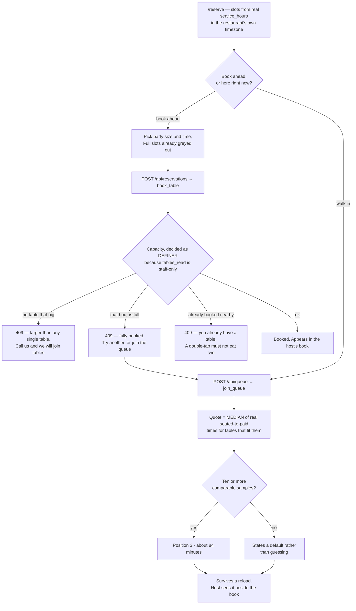

**Happy path**

1. `/reserve`. Slots are generated from the restaurant's real `service_hours` **in its own
   timezone**, four days ahead, in 30-minute steps. Full slots are greyed.
2. Pick a party size and a time → `POST /api/reservations` → `book_table()`.
3. Or, if she is already standing there, join the walk-in queue → `join_queue()`, which
   quotes a wait from the **median of real seated→paid durations** for tables that fit her
   party — not a host's guess. Below 10 comparable samples it states a default rather than
   dressing a guess as data.

**Refusals**

| She tries | What happens |
|---|---|
| A party bigger than any single table | 409, "That party is larger than any single table. Call us and we'll join tables." |
| A party of 400 | 400, "We can book parties of 1 to 20" — a different fact, so a different answer |
| A time in the past | 400 |
| A fully-booked slot | 409, and it points her at the walk-in queue |
| Two bookings an hour apart | 409 — a double-tap must not silently consume two tables |
| Join the queue twice | 409, "You're already in the queue." |
| Book without an account | 401 |

> **How it is tested**
>
> - **Automated:** `verify:features` block *Booking and the walk-in queue*. It finds a slot
>   with genuine room first, using the same capacity rule the route applies — asserting
>   "a booking succeeds" against an already-full Friday would test the seed, not the code.
> - **Schema:** `sql:check` asserts `book_table` exists and runs as security definer, and
>   that `reservation_load` exposes no `guest_id` or `guest_name`.
> - **By hand:** as `priya@brigade.test`, book tomorrow evening. Then sign in as
>   `host@brigade.test` and confirm it appears in the book.
>
> **The bug this flow had, worth knowing about:** booking was refused for *every* diner
> for two days. The route counted "tables that fit this party" using the caller's own
> session, and `tables_read` requires `is_staff()` — so a diner counted zero tables and
> got "fully booked" every single time. It looked finished because the seeded book was
> full of reservations, written by the seed with the service key: data the product itself
> could not have produced. See patch 005.

### Flow P3: find it again tomorrow

**Sign in as** `priya@brigade.test`.

**The problem** — a diner pays, closes the tab, and next day wants the bill. Until this flow
existed they could not have it: `/order/[id]` was reached once by a redirect, the cart was
cleared on the same line, and the id lived nowhere but the address bar. Their own order was
visible to the kitchen and not to them.

**How Brigade solves it** — one page, where the row decides where it sends you.
`orders_read_own` is `guest_id = auth.uid()`, so the database does the scoping and there is
no ownership check in the page at all.

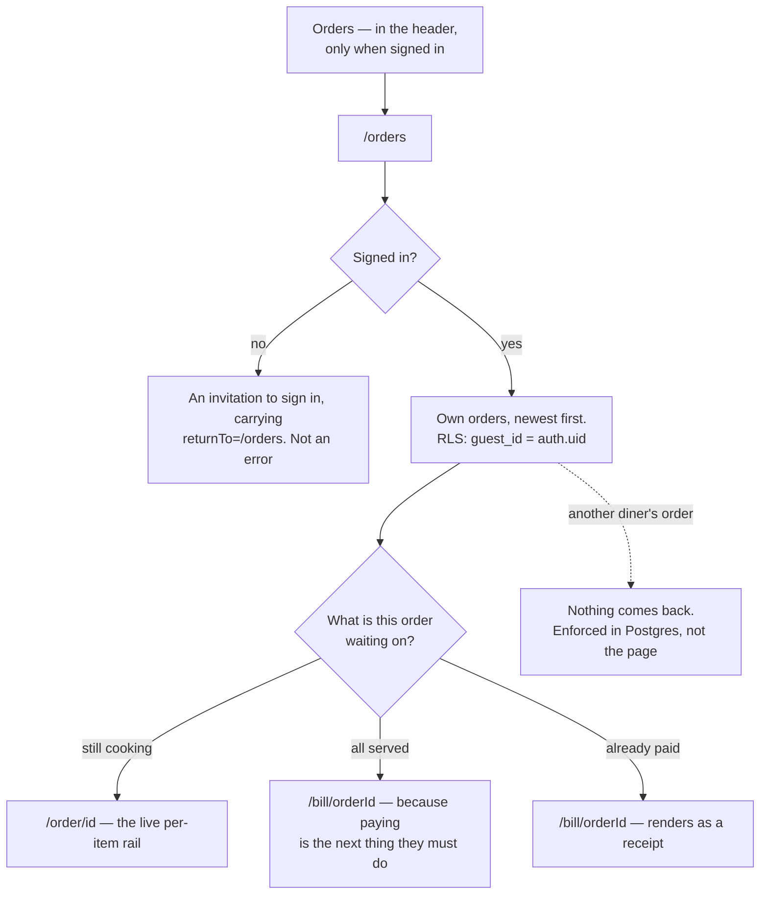

**Happy path**

1. `/orders`, from "Orders" in the header — shown only when signed in, because there is
   nothing behind it otherwise.
2. Every order she has placed, newest first: when, what (two dishes named, then a count),
   the total, and what it is waiting on.
3. Each row links **one** place, chosen from the order's state — still cooking → the live
   rail; everything served → the bill, because that is the next thing she must do; already
   paid → the same URL, which renders as a receipt. A row with two buttons makes the reader
   do work the screen already had enough information to do.

**Refusals**

| She tries | What happens |
|---|---|
| Read another diner's history | Nothing comes back — `orders_read_own` is `guest_id = auth.uid()` |
| Open `/orders` signed out | An invitation to sign in, carrying `returnTo=/orders` — not an error |

> **How it is tested**
>
> - **Automated:** `verify:features` block *Finding an order again afterwards*, which checks
>   the newest real order appears, that rows link into `/order/` or `/bill/`, that the header
>   links to the page at all, and that Dan cannot read Priya's history.
> - **By hand:** order something, close the tab, reopen the site, and find the bill.
>
> **Why this exists.** `/order/[id]` was a **true orphan** — nothing in the app linked to
> it. It was reached once, by the redirect after placing an order, and `clearCart()` runs on
> the same line, so the id survived nowhere but the address bar. Closing the tab put a
> diner's own order and bill permanently out of reach while the kitchen kept both on screen.
> This is the second time this build shipped a screen nothing linked to; `/cart` was the
> first. `verify:features` now greps the rendered HTML of every reachable page and fails if
> anything is linked from nowhere.

### Flow A1: get an account

**Sign in as** any of the ten seeded accounts, or sign up with an address you own to walk the
real verification path. Seeded password: `brigade-demo-2026`.

**The problem** — PS user story 2. An order is a commitment, so it needs a name attached —
but authentication is also the first thing a new person touches, and the point at which they
are least willing to feel stuck.

**How Brigade solves it** — email and password with a 6-digit code, or Google in one tap.
Roles are **never self-selected**: a signup that could choose its own role is privilege
escalation, so staff are seeded and a new account is always a guest. After signing in,
everyone lands on the surface for their job rather than a generic dashboard.

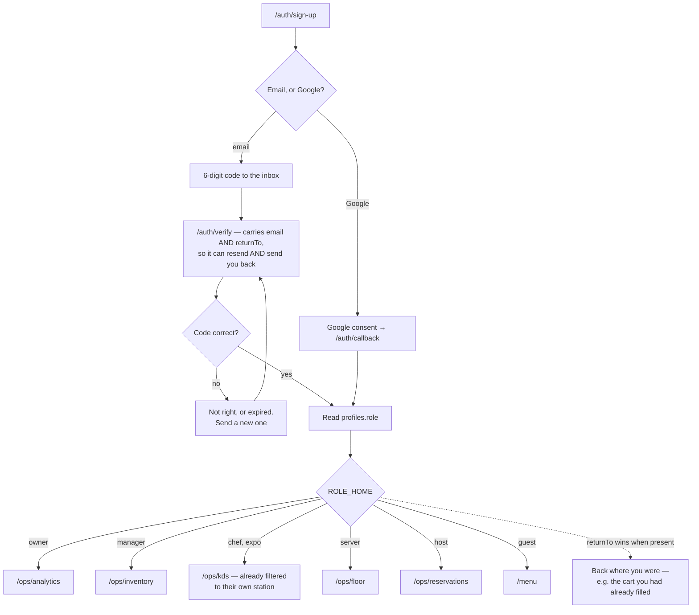

Applies to everyone, but a diner is the one who does it live.

1. `/auth/sign-up` — email + password, or **Continue with Google**.
2. Email signup sends a 6-digit code → `/auth/verify` → verified.
3. `/auth/sign-in` for later visits. After signing in, everyone lands on the surface for
   their role.
4. Sign out from the header — on ops it also shows *who* you are and your station, because
   on a shared wall screen that is a real question.

**Refusals:** a wrong password is refused; an unverified email cannot order.

> **How it is tested**
>
> - **Automated:** `verify:features` block *Signing in* (all seven staff roles plus two
>   diners, and a wrong password), and *Can you actually find any of it?* which checks the
>   header shows your name, offers a sign-out, and that signing out genuinely ends the
>   session rather than just changing the screen.
> - **By hand — do this one by hand, on a real phone.** It is the only flow that leaves
>   the app: a real inbox, a real code, a real Google consent screen.
> - ⚠ **Known risk:** Supabase's built-in email has a low hourly cap and will silently
>   stop sending mid-demo, which looks exactly like broken auth. Google OAuth is the safer
>   demo path. See `docs/08-runbook.md`.

---

## Rahul, the grill station

Wall-mounted screen read at about **two metres**, hot bright kitchen, glare on a
grease-filmed screen, hands busy, **no mouse**, eight-hour shift. Kitchen vernacular is
correct here — the pass, 86, fire, docket are what he actually says.

### Flow R1: work the station

**Sign in as** `grill@brigade.test` — Rahul Desai, chef de partie on grill. Then try
`saute@brigade.test` on the same ticket to watch the station gate refuse.

**The problem** — PS challenges 4 and 6, *"delayed communication between customers, staff and
kitchen"* and *"inefficient staff coordination."* Paper chits get lost, get wet, and carry no
state. Nobody can see how long a ticket has waited, and the wrong person can pick it up.

**How Brigade solves it** — dockets on a wall screen, filtered to the cook's own station from
their profile, with ticket age escalating in **three ways at once** — colour, glyph and words
— because kitchens have colourblind cooks and greasy screens. Every transition is validated
in the database, so the rule holds whatever the UI happens to render.

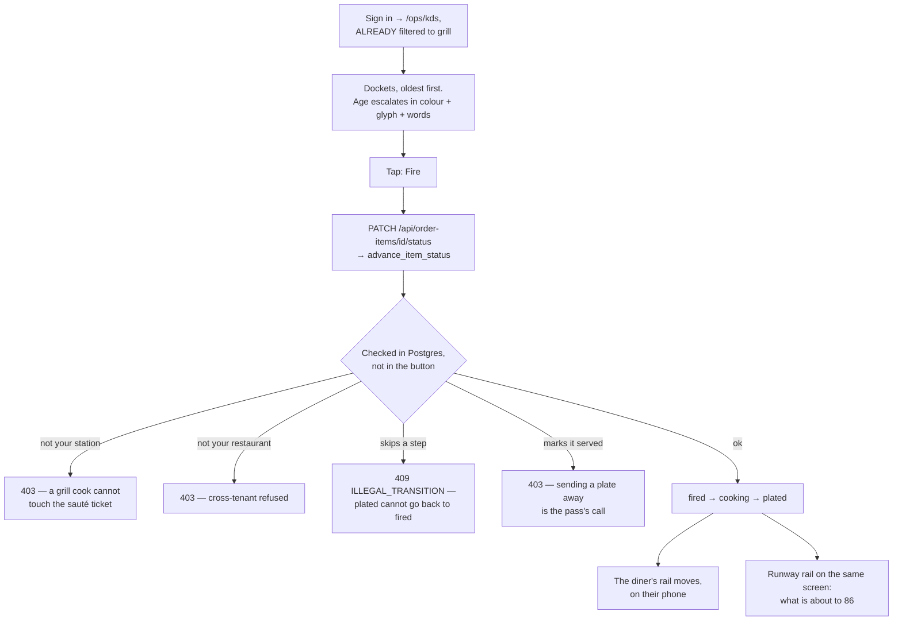

1. Sign in → lands on `/ops/kds`, **already filtered to grill**, from his profile's
   station. No selecting, no configuring.
2. Dockets arrive as guests order. Each shows the table, the items for his station, and
   how long the ticket has been waiting.
3. He taps through his own tickets: **fire → cooking → plated**. Large targets, no hover,
   everything visible at rest.
4. A rail down the side shows what is about to run out — see the runway board below.

**Refusals — this is where the authorization story actually lives**

| He tries | What happens | Why |
|---|---|---|
| Mark an item **served** | 403, "Sending a plate away is expo's call." | The pass decides what leaves the kitchen |
| Touch a **sauté** ticket | 403 | He works his station |
| Move a ticket **backwards** (plated → fired) | 409, "That isn't the next step for this item." | |
| Change his own station to sauté, to get at its tickets | 403 | Station is a rota decision, not self-service |
| Read ingredient costs | Nothing comes back | Cost is manager and owner only |
| Change a stock level | 403, "Changing stock is a manager's call." | |

> **How it is tested**
>
> - **Automated:** `verify:features` block *The kitchen screen* walks fire → cooking →
>   plated as the grill chef and then checks every refusal above, including the
>   wrong-station one. *Going around the app* checks he cannot re-station himself or move
>   stock by talking to the database directly, skipping the app.
> - **Schema:** `sql:check` asserts `advance_item_status` checks both station *and* tenant,
>   and that `profiles_update_self` pins station as well as role.
> - **By hand:** two windows. Order as Priya, watch the docket appear. Then try to press
>   Served as Rahul — it must refuse. Sign in as `expo@brigade.test` and it must succeed.
>   **Stand two metres back and read it.** Nothing automated can check that.
>
> **The bug this flow had:** `advance_item_status()` checked *neither* station nor tenant.
> A host fired a grill ticket and got HTTP 204, while the docs claimed "a chef de partie
> works their own station". Patch 003 for the gate; patch 006 for the self-restation hole
> that still bypassed it.

---

## Joss, the pass

### Flow E1: send plates away

**Sign in as** `expo@brigade.test` — Joss Bell, on the pass.

**The problem** — a table should be served together, and the person who cooked one dish is
the worst judge of whether the whole table is ready. Someone has to own the moment food
leaves the kitchen.

**How Brigade solves it** — expo sees **every** station where a cook sees only their own, and
`plated → served` is restricted to expo, server, manager and owner inside
`advance_item_status()`. A cook's fat-finger cannot mark food served that never left.

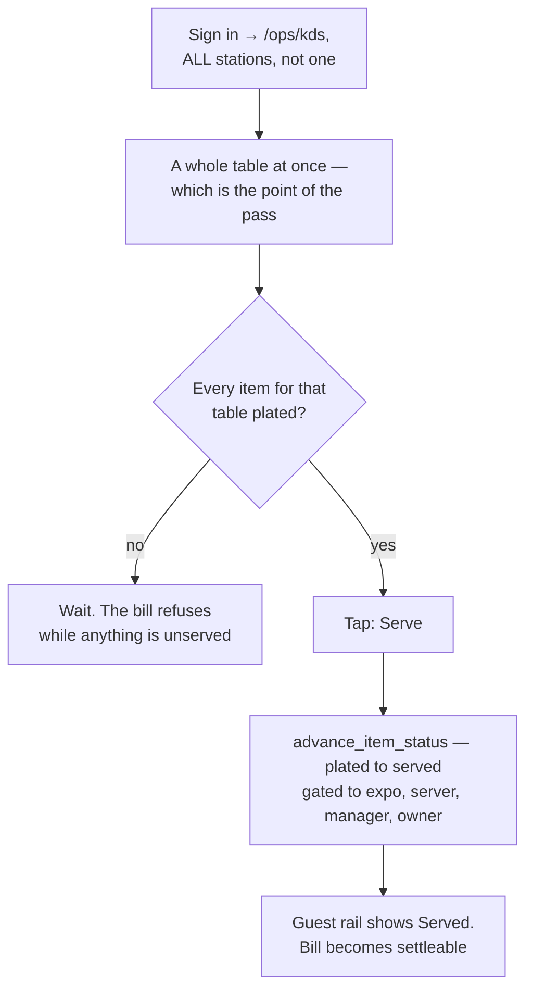

1. Sign in → `/ops/kds`, but across **all** stations, because the pass is the one place
   that sees a whole table at once.
2. When every item for a table is plated, send them: **plated → served**.

**Refusals:** cannot mark an item served that was never cooked — the transition order is
validated in the database, not by whichever button happened to render.

> **How it is tested**
>
> - **Automated:** the *served* step of *The kitchen screen*, and the "the pass can send
>   every plate away" check inside *The bill*.
> - **By hand:** as `expo@brigade.test`, note you see every station's tickets where Rahul
>   saw only grill.

---

## Kit, the floor

### Flow S1: the floor, and the bill

**Sign in as** `server@brigade.test` — Kit Nwosu, chef de rang.

**The problem** — PS challenge 5, *"manual order, billing and inventory management."* A table
that has paid but not been cleared is not free, and seating a party at it is worse than
leaving it empty. Handwritten bills also charge for food that never arrived.

**How Brigade solves it** — table state is driven by real events rather than typed in:
attaching an order seats the table, settling releases it to **dirty**, never straight back to
free. The bill is priced server-side from what was actually **served**, at the price captured
on each line when it was ordered — so a menu price change tonight cannot alter a bill from an
hour ago.

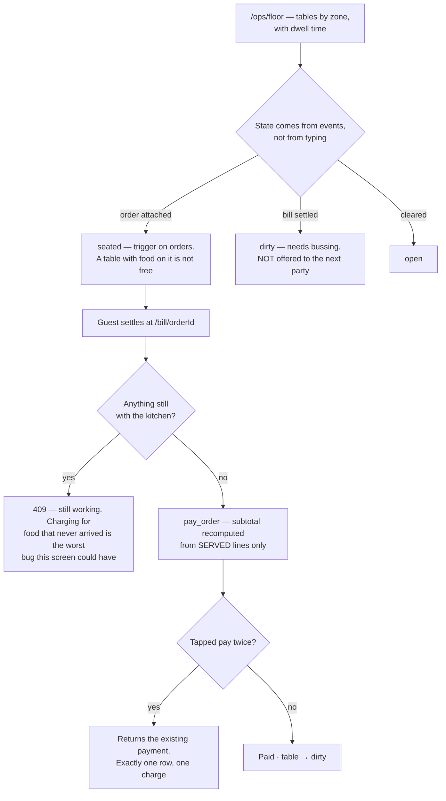

1. Sign in → `/ops/floor`. Tables by zone, with their state and how long each has been
   sitting.
2. A table with an order on it reads **seated**. When its bill is settled it goes
   **dirty** — needs bussing — not straight back to free.
3. Billing: the guest can settle from `/bill/<orderId>`, priced from what was served.

**Status:** the floor map is **read-only** — it shows real state, and manual seating and
bussing actions are not wired. That is a stated cut, not an oversight: the states it shows
are driven by real events (ordering seats a table, paying dirties it), which is what makes
the screen honest.

> **How it is tested**
>
> - **Automated:** `verify:features` block *The floor plan*, which also asserts the room is
>   in **more than one state** with something free. A floor where every table reads
>   identically is either a runaway trigger or nothing wired at all, and both look
>   plausible on screen.
> - **By hand:** watch one table go open → seated → dirty across a full order-and-pay.
>
> **The bug this flow had:** a table with food on it showed as **free**. `pay_order()`
> correctly released paid tables to dirty, but nothing ever set the other end, so ordering
> left the table open. Only the seed had ever written "seated", so every screenshot looked
> right. Patch 004, as a trigger on `orders` — the rule belongs to the table, not to one
> function that happens to insert into it.

---

## Sofia, the book

### Flow H1: the book and the queue

**Sign in as** `host@brigade.test` — Sofia Marín, maître d'.

**The problem** — PS challenge 3 from the other side of the podium. Seating decisions mean
trading the book against the queue, and if those live in two places the host does the join in
their head while people watch.

**How Brigade solves it** — both halves on one screen: upcoming bookings with party sizes,
and the live walk-in queue with each party's data-derived quote beside it.

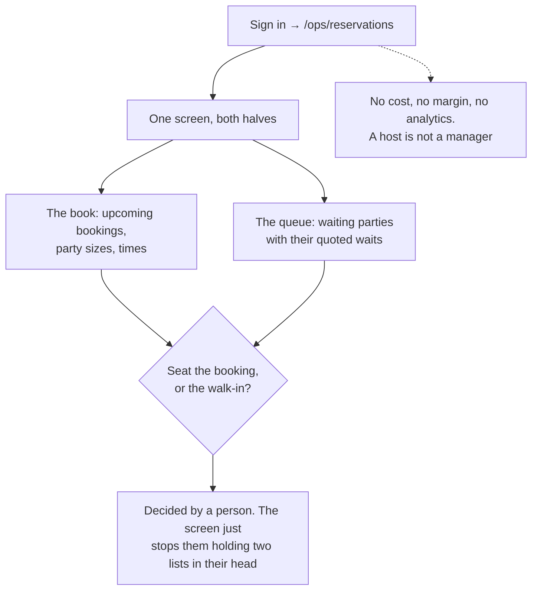

1. Sign in → `/ops/reservations`. Upcoming bookings with party sizes and times, and the
   live walk-in queue with each party's quoted wait alongside.
2. Both halves in one view, because seating decisions are made by trading one against the
   other.

**Status:** **read-only.** Seating a booking and marking a no-show are not wired.

**Refusals:** she is a host, so she has no access to costs, margins or the money screens.

> **How it is tested**
>
> - **Automated:** the host checks in *Booking and the walk-in queue* — and specifically
>   that the book **has bookings on it**, not merely that the page returned HTTP 200.
> - **By hand:** as `host@brigade.test`, confirm you can see the book but not
>   `/ops/analytics`'s money.
>
> **The bug this flow had:** the reservations table was **empty** — always had been. The
> seed made queue entries and not one booking, so this screen demoed as a blank page while
> every check passed. Booking worked; there was nothing to look at, which to anyone
> watching is the same as broken. The seed now writes a deliberately uneven book — tonight
> busy from 19:00, tomorrow's lunch quiet — because greyed slots on `/reserve` only mean
> something if some hours are fuller than others.

---

## Tom, the pantry

### Flow M1: the pantry

**Sign in as** `manager@brigade.test` — Tom Ellery, sous chef.

**The problem** — PS challenge 5, and the inventory half of the whole brief. Stock counted on
paper is wrong by the time it is typed up, reorder quantities are guessed, and nobody can say
where stock left without being sold.

**How Brigade solves it** — an **append-only ledger**. `stock_qty` is a projection of
`stock_movements`, and stock is only ever moved by `place_order()` or `adjust_stock()`. There
is no path — including talking straight to the database — that moves it without writing a
row. Reorder points come from real consumption × supplier lead time × 1.2, summed window by
window over actual service hours.

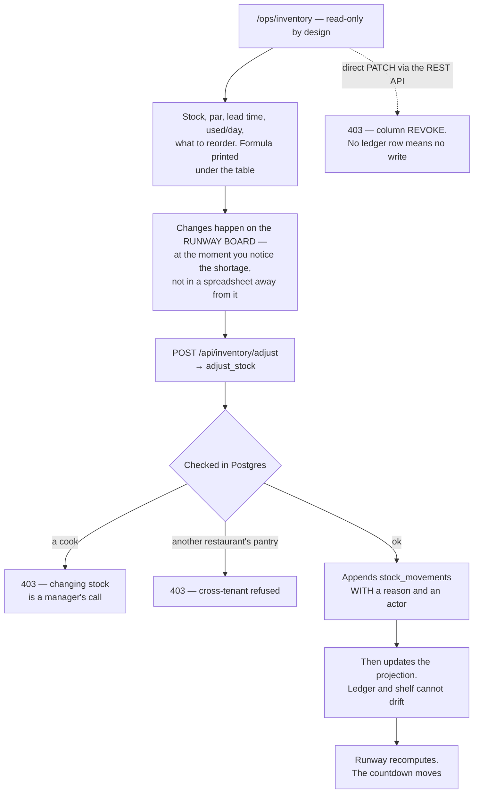

1. Sign in → `/ops/inventory`. Every ingredient with stock, par level, supplier lead time,
   what it costs, how much gets used per day, and what to reorder.
2. Daily usage is summed **window by window** over the restaurant's real service hours, so
   the dinner rush rate is not charged to lunchtime.
3. Reorder point = daily usage × lead time × 1.2. The formula is printed under the table,
   so it can be checked rather than trusted.
4. **Stock changes happen on the runway board**, deliberately — at the point where you can
   see what the shortage is about to cost you, not in a spreadsheet away from the
   consequence. `/ops/inventory` is read-only and says so on the page.

### Flow M2: the menu and the recipes

**Sign in as** `manager@brigade.test`, or `owner@brigade.test` for the same screen with
ownership settings.

**The problem** — PS challenge 2, *"limited visibility into menu items and restaurant
services."* A menu is usually a design file, disconnected from what a dish costs to make or
whether it can be made at all.

**How Brigade solves it** — every dish carries its bill of materials, so cost and margin are
computed rather than typed, and availability falls out of the same data. Quantities are
staff-only and scoped to the caller's own restaurant, because a recipe is the one thing a
restaurant most wants kept from a competitor.

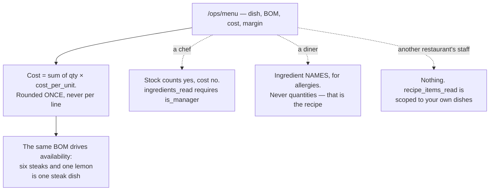

`/ops/menu` — every dish with its bill of materials, what it costs to make, and its
margin. **Read-only:** recipe editing is a stated cut.

**Refusals:** stock cannot be changed except through `adjust_stock()` or `place_order()`.
There is no path — including talking straight to the database, and including through a
view — that moves stock without writing a ledger row.

> **How it is tested**
>
> - **Automated:** `verify:features` block *The pantry and the recipes* books in a
>   delivery, checks it left **exactly one** entry in the record book, corrects it back,
>   then tries the same change as a chef (403) and directly against the database (403).
>   *Going around the app* repeats the attempt through every view.
> - **Schema:** `sql:check` asserts `stock_qty` is not updatable by `authenticated` while
>   `par_level` still is (so the revoke was not too broad), that stock cannot go negative,
>   and that **no view in `public` is writable** by `anon` or `authenticated`.
> - **By hand:** top up a binding ingredient on `/ops/runway` and watch the dish's
>   countdown move. Then check `/ops/inventory` reflects it.
>
> **The worst bug of the build was here.** Every view in `public` accepted writes from
> `anon`, and bypassed RLS: a **chef** rewrote `stock_qty` from 4.565 to 999 through
> `ingredients_public` with **no ledger row**, while the identical PATCH on the base table
> correctly returned 403. Three ordinary facts combined — Supabase grants write access on
> new views by default, a single-table view is auto-updatable, and a view without
> `security_invoker` runs as owner. `sql-lint` had flagged those views and the warning was
> waved through, because the review only considered whether a guest could *read* them.
> Patch 006.

---

## Meera, the numbers

Desktop, end of service. Wants to know what lost money and what to order tomorrow.

### Flow O1: the numbers

**Sign in as** `owner@brigade.test` — Meera Kapoor, chef de cuisine. Then open the same page
as `grill@brigade.test` to see the cost gate.

**The problem** — PS challenge 7, *"lack of operational insights and business analytics."*
Most restaurants know last night's revenue and nothing else. Which dishes to protect,
reprice, promote or cut gets decided on instinct.

**How Brigade solves it** — the **Kasavana–Smith matrix** over six weeks of real trading:
popularity against contribution margin, split on the **median** of each axis rather than the
mean, which a single outlier drags. Below 30 paid orders it draws no matrix at all and says
why.

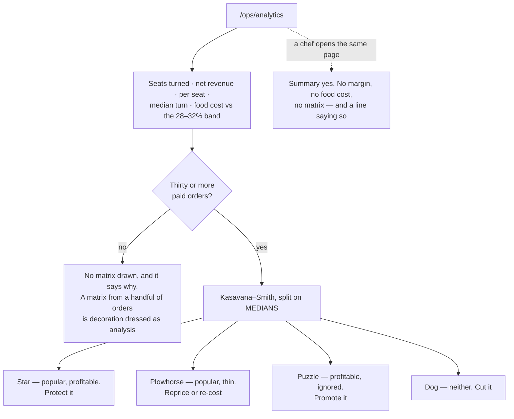

1. Sign in → `/ops/analytics`.
2. **Service summary:** seats turned, net revenue, spend per seat, median turn time, and
   food cost as a percentage against the 28–32% industry band.
3. **The menu-engineering matrix** (Kasavana–Smith): every dish placed by popularity
   against contribution margin, split on the **median** of each axis — not the mean, which
   a single outlier drags. Four quadrants, each labelled in words as well as position:
   **Star** (keep), **Plowhorse** (popular, thin — reprice or re-cost), **Puzzle**
   (profitable, ignored — promote), **Dog** (neither — cut).
4. Below 30 paid orders it draws **no matrix at all** and says why. A matrix from a handful
   of orders is decoration dressed as analysis.

**Refusals:** a chef opening this page sees the summary without any margin, food cost or
matrix, and a line telling them so. That is the design, not a lockout — cost is gated,
the screen is not.

> **How it is tested**
>
> - **Automated:** `verify:features` block *End-of-service numbers* checks all four
>   quadrant labels are present for the owner and that **none** of them are for a chef,
>   along with the "hidden for your role" line.
> - **By hand:** open `/ops/analytics` as owner and as `grill@brigade.test` side by side.
>
> **The bug this flow had:** food cost printed **5.9%**, directly above the line naming
> the 28–32% band it compares to. PostgREST caps responses at 1000 rows and a client-side
> `.limit(20000)` cannot raise it — so the ratio came from 1000 of 3411 order items, with
> HTTP 200 and no error, the real count only in a header nobody reads. The twenty dish
> counts summing to exactly 1000 was the tell. Now paged: **22.4%**, matching an
> independent recomputation. Two tiles were also renamed to what they actually measure —
> "seats turned" is seats at the tables used, not guests.

---

## The runway board

**Sign in as** any staff account. Use `manager@brigade.test` or `owner@brigade.test` if you
want the top-up buttons.

**The problem** — PS challenges 1 and 2 together, and the reason this project exists. Toast
and Square already deplete stock from recipes and auto-86 a dish, so *that* is table stakes.
What no till does is tell you **when** you will run out. The kitchen finds out at zero, which
is the one moment when nothing can be done about it.

**How Brigade solves it** — runway: portions ÷ tonight's actual sell rate, in minutes. Every
row names the ingredient that binds it, because "prawns 86 at 20:40" is information and
"because you have 0.55kg of prawns" is something a chef can act on in five minutes. And it
refuses to guess — four distinct honest answers rather than one fabricated time.

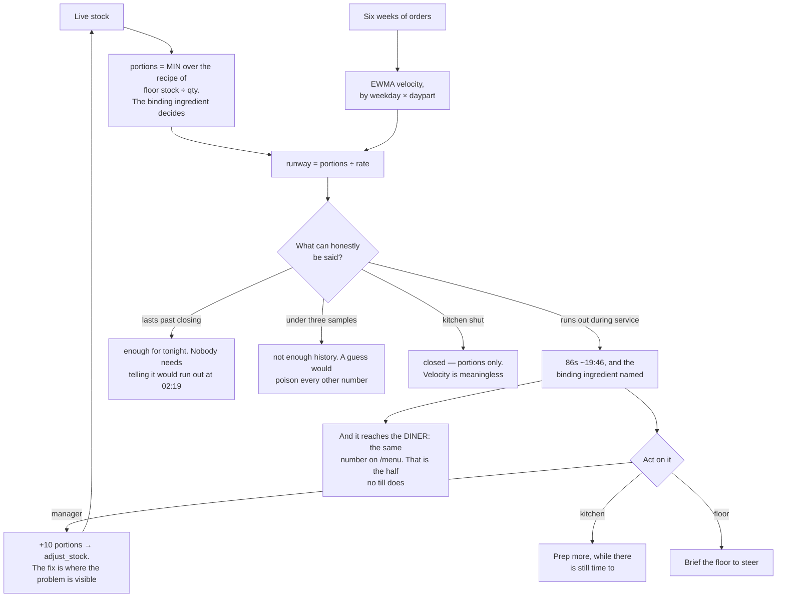

`/ops/runway`, visible to all staff. This screen **is** the differentiation claim, and it
is the one to demo.

Every other till tells you a dish **is** out. This tells you **when** it will be, while
there is still time to prep more, adjust the menu, or brief the floor.

Each row carries:

- **portions left**, from the recipe against live stock — the binding ingredient decides,
  so six steaks and one lemon is one steak dish;
- **when it will 86**, from that dish's own sell rate for this weekday and this daypart
  (EWMA over the last six comparable slots);
- **which ingredient is the constraint** — "tandoori prawns 86s at 20:40" is information;
  "because you have four lemons" is something a chef can act on in five minutes;
- for a manager, a **top-up button**, so the fix is where the problem is visible.

**What it refuses to say** is as important as what it says. Every row states one of four
things and never a blank:

| It says | When |
|---|---|
| `86s ~20:40` | It will run out during service |
| `enough for tonight` | Correct arithmetic, useless statement — nobody needs telling the jeera rice would run out at 02:19 if service carried on |
| `not enough history` | Fewer than 3 comparable samples. A guess dressed as a prediction poisons trust in every other number on the screen |
| `closed` | Outside service hours, where velocity means nothing |

> **How it is tested**
>
> - **Automated:** `verify:features` block *The runway board*, which checks that
>   predictions exist, that **every prediction falls inside tonight's opening hours in the
>   restaurant's own timezone**, that every dish is accounted for with none silent, that
>   the constraint ingredient is named, and that each gauge's spoken label agrees with what
>   is on screen.
> - **Unit:** all 69 tests in `npm test` are this engine — banding, suppression, cold
>   start, the timezone edges.
> - **By hand:** the demo itself. On `/ops/runway`, top up the binding ingredient of the
>   scarcest dish and watch its countdown move. Then open `/menu` on a phone and see the
>   guest-facing number change too — availability reaching the *guest* is half the claim.
>
> **Two bugs this flow had.** Predictions were an hour out and, near midnight, loaded the
> wrong day's hours entirely, because `restaurants.timezone` was never read. And the gauge
> told screen-reader users a dish "runs out about 23:14" while the screen said "enough for
> tonight" — a prediction spoken only to blind users after it was deliberately withheld
> from everyone else, because the suppression rule was added to the visible branch and not
> to the label.

---

## Deliberately not built

Named here so no flow above implies something that is not there. Each is marked `cut` in
its own feature doc with the reasoning.

| Not built | What that means for a flow above |
|---|---|
| Staff / shift management | No rota screen. Roles and stations are seeded |
| Split billing | One bill per order |
| Supplier auto-ordering | Reorder is *suggested*, never sent |
| Waste-variance UI | The maths is tested; nothing surfaces it |
| Recipe editing | `/ops/menu` shows the BOM, cannot change it |
| Notifications | Tables and generators exist and are tested; nothing writes them on a schedule and there is no UI |
| Recommendations | The engine is tested; the guest menu ranks by steering but does not say "you might like" |

---

## A five-minute demo path

If someone has five minutes, this order tells the story: the menu is a live function of
the pantry, and scarcity is predicted rather than reported.

1. **`/menu` on a phone.** Point at a dish showing "3 left · 86s ~21:29". *This number is
   the pantry, not a setting.*
2. **`/ops/runway` on a laptop.** Same dish, counting down, naming the ingredient that
   binds it. *Toast and Square tell you a dish is out. This says when.*
3. **Order it on the phone.** The count drops on both screens.
4. **`/ops/kds` as `grill@brigade.test`.** The docket is there. Fire it, cook it, plate it.
   Then press **Served** — refused, because that is the pass's call. Sign in as
   `expo@brigade.test` and it works. *Authorization is in the database, not in which
   button rendered.*
5. **Top up the binding ingredient** on the runway board. Both screens move.
6. **`/ops/analytics` as `owner@brigade.test`.** Four populated quadrants from six weeks of
   real trading history. Then the same page as the chef — no margin, no matrix, and a line
   saying why.
7. **`npm run check`.** Seven questions in plain English, all green. *Everything you just
   clicked is clicked by a script on every run.*

Full script, with the timings and the fallbacks if something is down:
[`docs/07-submission.md`](07-submission.md).
